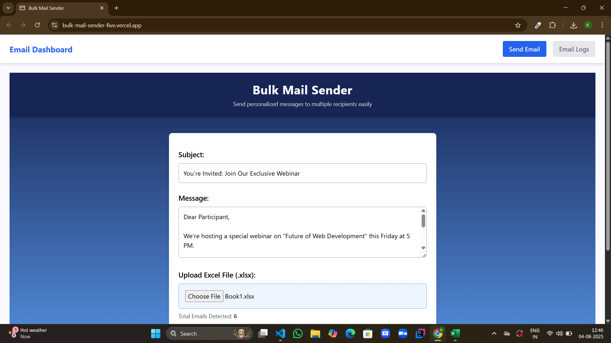
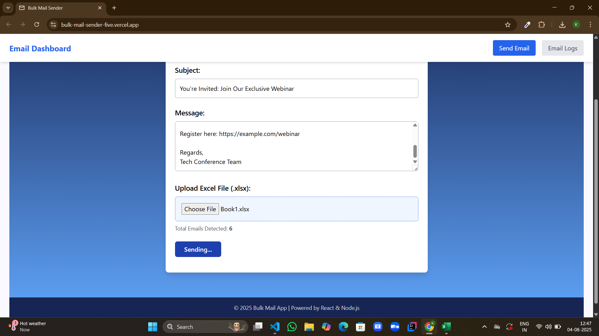
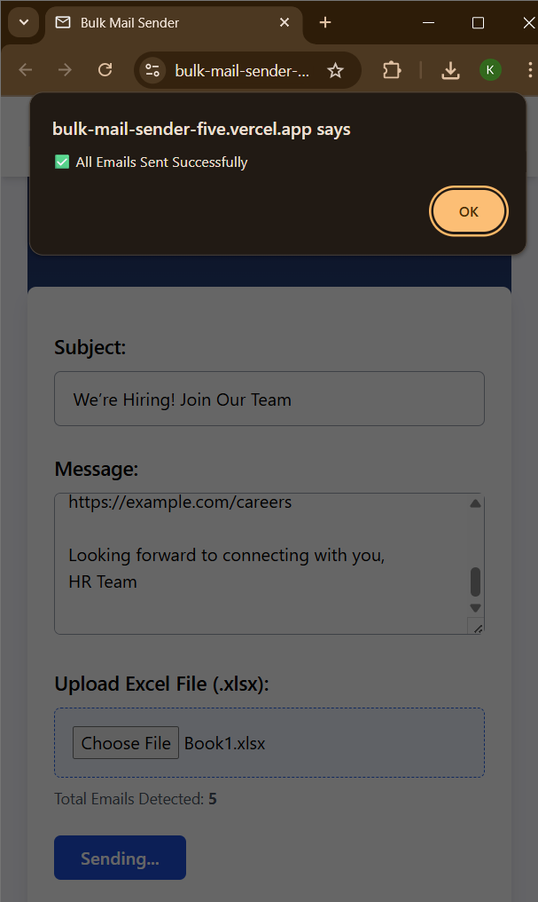
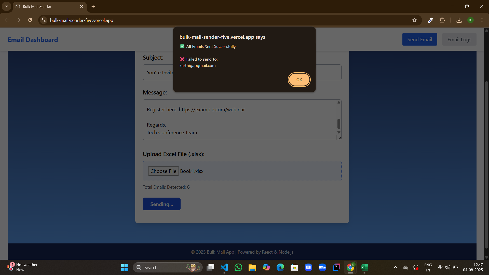
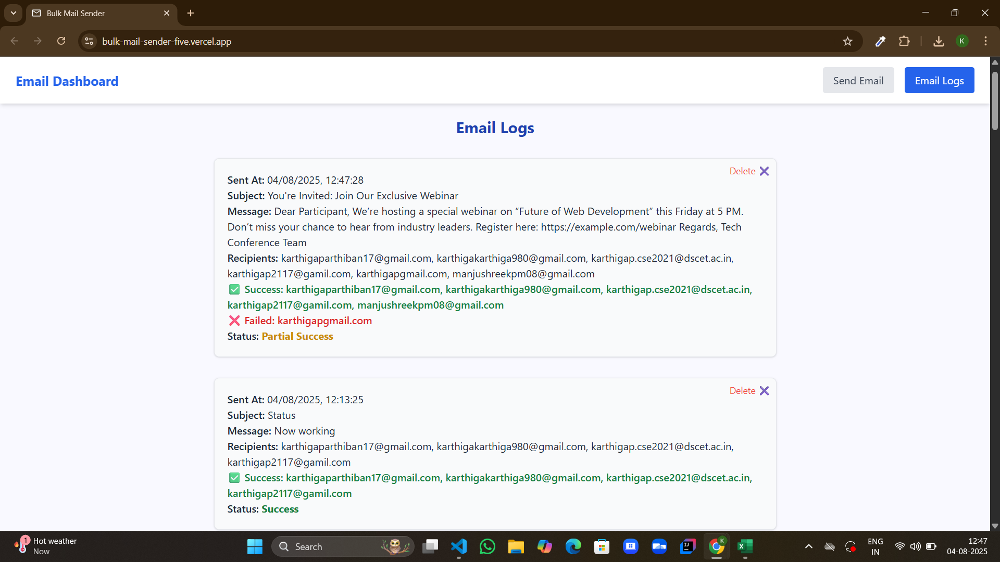

# BulkMail Sender [Live Site](https://bulk-mail-sender-five.vercel.app)

BulkMail Sender is a full-stack web application that allows users to upload an Excel file of email addresses and send bulk emails with a custom message. Built using React, Node.js, Express, and MongoDB, it features real-time feedback, clean UI, and seamless frontend-backend integration.

## Features

- Upload `.xlsx` file with email list  
- Compose and send personalized messages  
- Email validation and error handling  
- Displays success/failure status after sending  
- Uses Nodemailer with Gmail SMTP  
- Stores sent email logs in MongoDB  
- Fully responsive design with Tailwind CSS  
- Frontend deployed on Vercel, Backend on Render  

## Tech Stack

### Frontend
- React.js (Vite)
- Tailwind CSS
- Axios
- XLSX.js

### Backend
- Node.js
- Express.js
- Nodemailer
- MongoDB (Mongoose)
- CORS

### Deployment
- Vercel (Frontend)
- Render (Backend)
- MongoDB Atlas (Cloud Database)

## Folder Structure

BULKMAIL/
├── backend/
│ ├── index.js
│ ├── package.json
│ └── package-lock.json
│
├── frontend/
│ ├── public/
│ │ ├── logo.png
│ │ └── vite.svg
│ ├── src/
│ │ ├── assets/
│ │ ├── Screenshots/
│ │ │ ├── Email History.png
│ │ │ ├── Homepage.png
│ │ │ ├── SendingEmails.png
│ │ │ ├── Success_sm.png
│ │ │ └── SuccessFailedAlert.png
│ │ ├── App.css
│ │ ├── App.jsx
│ │ ├── EmailLogs.jsx
│ │ ├── Home.jsx
│ │ ├── index.css
│ │ └── main.jsx
│ ├── index.html
│ ├── package.json
│ ├── postcss.config.js
│ ├── tailwind.config.js
│ ├── vite.config.js
│ ├── eslint.config.js
│ └── .gitignore

## How It Works

1. User uploads an `.xlsx` file with a list of email addresses  
2. A message is composed in the provided text field  
3. On clicking **Send Email**, the frontend calls the backend API  
4. Backend uses **Nodemailer** with Gmail SMTP to send emails individually  
5. The status of each email (success or failure) is displayed  
6. MongoDB stores the sent email logs  

## Live Demo

- **Frontend:** [https://bulk-mail-sender-five.vercel.app](https://bulk-mail-sender-five.vercel.app)  
- **Backend:** [https://bulkmail-sender.onrender.com](https://bulkmail-sender.onrender.com)

## Screenshots

### Homepage  

### Sending Emails  

### Success Alert  

### Mixed Result Alert  

### Email History  

## Author

**Karthiga P**  
- Full Stack Developer  
- GitHub: [KarthigaP20](https://github.com/KarthigaP20)  

## Feedback & Thank You

Thank you for visiting and exploring the BulkMail Sender project.  
If you have suggestions, feedback, or want to collaborate, feel free to reach out via GitHub.  
Your input is always appreciated!